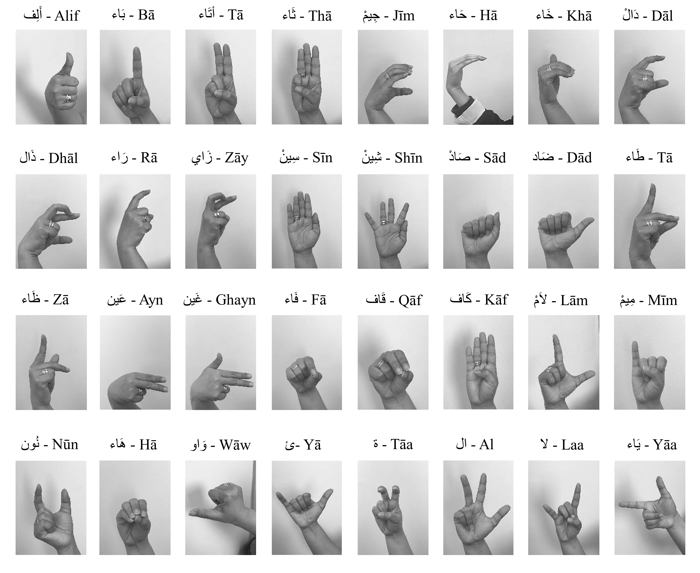
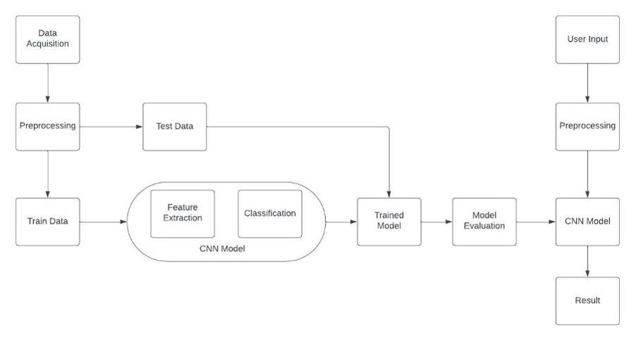
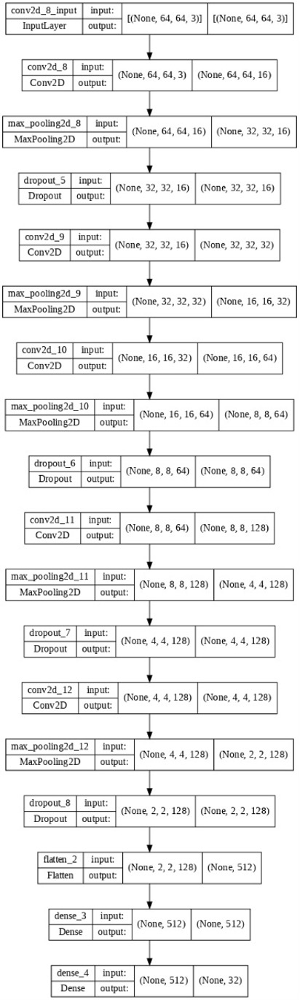
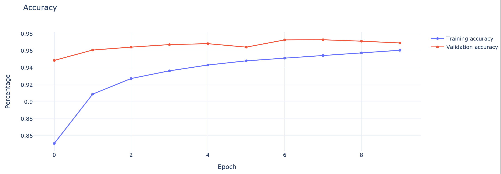

# Sign Language Recognition System
The main goal of this project is to design, implement and evaluate a model that can recognize sign language letters in real-time and give a direct translation. By creating this model we can improve the quality of life for people who are deaf by allowing other developers to implementing it through their applications and hardware devices they are working on. In return this can open up more room for improvement for the technology related to hearing impairment people.
  

    

  

## Results
  

    

  

## Abstract 
People with hearing disability face many challenges when going out alone in public communication can be very hard and time-consuming. Even though a lot of efforts were made to improve this problem, there is still more to be done. In this project, we propose a model that can recognize and translate sign language letters in real-time by using a camera and a screen to display the translation. Creating this model and making it public can allow more room for improvement and enable developers to implement it in their applications or hardware devices which opens up room for more ideas that were previously not possible. In return, this enhances the quality of life for people with hearing impairment.

## Dataset
The dataset that we’re going to use is the “Arabic Alphabets Sign Language Dataset (ArASL)” which consists of 54,049 images of Arabic sign language gestures demonstrated by more than 40 people. The dataset is available on Mendeley data website. We will implement a neural network model which uses the given dataset to compare the user’s gestures with the dataset to correctly evaluate if the demonstrated gesture done by the user is correct.

## Execution
We implemented a neural network model which uses the given dataset to compare the user’s gestures with the dataset to correctly evaluate if the demonstrated gesture done by the user is correct.

### Workflow
  

    

  

### System Digfram 
  

    

  

## Model
We constructed a model with 17 layers using the convolutional neural network approach. The first layer is a convolutional layer with ‘same padding' and a 'relu' activation function, followed by a Max pooling layer and a dropout layer, which we repeated twice, and finally a dropout layer. Repeat until you reach the fifteenth layer, then we added a flatten layer and add the dense layer twice, once with the 'relu' activation function and the last layer with the 'softmax' activation function. Finally, we implemented the optimizer 'adam' and the loss function 'categorical crossentropy' for compilation.

  

    

  

The accuracy of the model was 97 percent after the first test, so this indicates that no more development is necessary, as any additional trials to enhance the model will simply result in lower accuracy.
